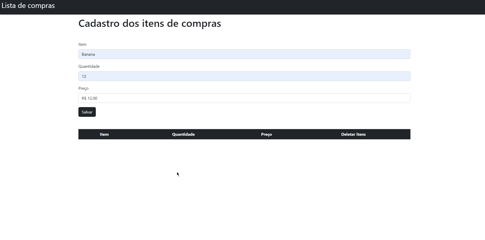

<h1>Projeto Lista de Compras</h1>

## Sobre
<p>Aplicação construída em Bootstrap e jQuery de uma lista de compras que acrescenta itens na página por meio de um formulário</p>

## Tecnologias 
- HTML
- CSS
- Bootstrap
- jQuery

## Página principal
<h1>
    
</h1>

## Pré-requisitos
Antes de começar, você vai precisar ter instalado em sua máquina as seguintes ferramentas:
[Git](https://git-scm.com) e algum editor de código(VS Code, Sublime Text, etc.)


### Rodando o projeto

```bash
# Clone o repositório
$ git clone <https://github.com/andrehferrari/ListaDeCompras.git>

# Acesse a pasta do repositório no terminal/cmd
$ cd ListaDeCompras

# Após isso, abra o arquivo index.html
```

Made with love by André Ferrari